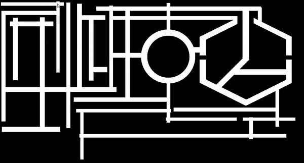
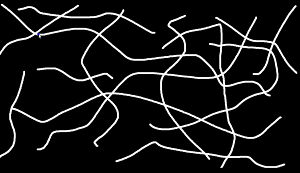

[![Contributors][contributors-shield]][contributors-url]
[![Forks][forks-shield]][forks-url]
[![Stargazers][stars-shield]][stars-url]
[![Issues][issues-shield]][issues-url]
[![MIT License][license-shield]][license-url]
[![LinkedIn][linkedin-shield]][linkedin-url]


<!-- PROJECT LOGO -->
<br />

  <h3 align="center">Path Finding (A* algorithm)</h3>

  <p align="center">
    A simple C++ and SFML based implementation of A-star searching algorithm for a path-finding application
    <br />
    <br />
    <a href="https://github.com/Cyna298/Path-Finding-A-star">View Demo</a>
    ·
    <a href="https://github.com/Cyna298/Path-Finding-A-star/issues">Report Bug</a>
    ·
    <a href="https://github.com/Cyna298/Path-Finding-A-star/issues">Request Feature</a>
  </p>
</p>


<!-- TABLE OF CONTENTS -->
<details open="open">
  <summary><h2 style="display: inline-block">Table of Contents</h2></summary>
  <ol>
    <li>
      <a href="#about-the-project">About The Project</a>
      <ul>
        <li><a href="#built-with">Built With</a></li>
      </ul>
    </li>
    <li>
      <a href="#getting-started">Getting Started</a>
      <ul>
        <li><a href="#prerequisites">Prerequisites</a></li>
        <li><a href="#installation">Installation</a></li>
      </ul>
    </li>
    <li><a href="#usage">Usage</a></li>
    <li><a href="#contributing">Contributing</a></li>
    <li><a href="#license">License</a></li>
    
  </ol>
</details>


<!-- ABOUT THE PROJECT -->
## About The Project


### Built With

* [C++](https://gcc.gnu.org/)
* [SFML](https://www.sfml-dev.org/)


<!-- GETTING STARTED -->
## Getting Started

To get the code up and running follow these simple steps.

### Prerequisites

First you would need to download and setup the SFML library in the IDE of your choice. Follow the setup tutorial given on their offical page
* SFML
  ```sh
  https://www.sfml-dev.org/download.php
  ```
And then simply run the [main.cpp](Code%20Files/main.cpp) file


<!-- USAGE EXAMPLES -->
## Usage

If you simply wish to run the program. You can run the [SFML.exe](SFML.exe) file, it works out of the box.
* Everything in white color will be considered paths

* Left Mouse Click anywhere on anywhere on a path to set the starting location

* Next, Left Mouse Click anywhere on a path to set the ending location and the algorithm should start working 



* Replace the [map.png](map.png) with your own image for custom paths




<!-- CONTRIBUTING -->
## Contributing

Contributions are what make the open source community such an amazing place to be learn, inspire, and create. Any contributions you make are **greatly appreciated**.

1. Fork the Project
2. Create your Feature Branch (`git checkout -b feature/AmazingFeature`)
3. Commit your Changes (`git commit -m 'Add some AmazingFeature'`)
4. Push to the Branch (`git push origin feature/AmazingFeature`)
5. Open a Pull Request


<!-- LICENSE -->
## License

Distributed under the MIT License. See `LICENSE` for more information.


<!-- MARKDOWN LINKS & IMAGES -->
<!-- https://www.markdownguide.org/basic-syntax/#reference-style-links -->
[contributors-shield]: https://img.shields.io/github/contributors/Cyna298/Path-Finding-A-star.svg?style=for-the-badge
[contributors-url]: https://github.com/Cyna298/Path-Finding-A-star/graphs/contributors
[forks-shield]: https://img.shields.io/github/forks/Cyna298/Path-Finding-A-star.svg?style=for-the-badge
[forks-url]: https://github.com/Cyna298/Path-Finding-A-star/network/members
[stars-shield]: https://img.shields.io/github/stars/Cyna298/Path-Finding-A-star.svg?style=for-the-badge
[stars-url]: https://github.com/Cyna298/Path-Finding-A-star/stargazers
[issues-shield]: https://img.shields.io/github/issues/Cyna298/Path-Finding-A-star.svg?style=for-the-badge
[issues-url]: https://github.com/Cyna298/Path-Finding-A-star/issues
[license-shield]: https://img.shields.io/github/license/Cyna298/Path-Finding-A-star.svg?style=for-the-badge
[license-url]: https://github.com/Cyna298/Path-Finding-A-star/blob/master/LICENSE.txt
[linkedin-shield]: https://img.shields.io/badge/-LinkedIn-black.svg?style=for-the-badge&logo=linkedin&colorB=555
[linkedin-url]: https://www.linkedin.com/in/mubariz-barkat-ali-0a8b86191/
